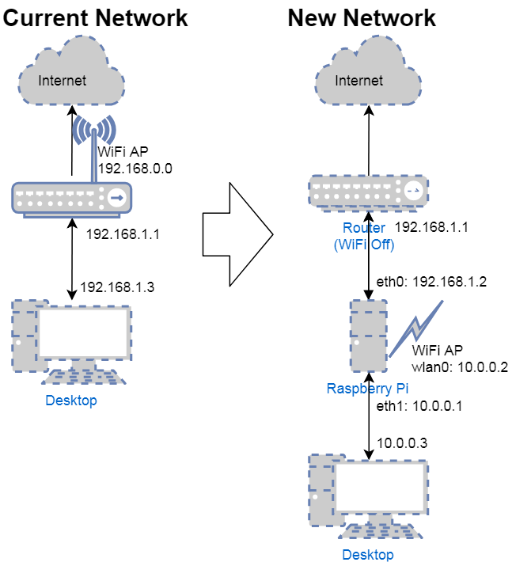

## Raspberry Pi Router/Access Point Setup

The objective of this setup is to configure a Raspberry Pi running Raspbian Stretch to act as a router serving a LAN from a USB ethernet port
and as a wireless access point. The idea is to provide the features of a home router but with filtering done through
hosts configuration to block unwanted traffic, provide a way of monitoring traffic, and cacheing DNS queries.

The network diagram below illustrates the current home network and the new one setup with the RPi. It assumes the home router is the gateway to the internet with IP 192.168.1.1. The WiFi access point for the network will be moved to the RPi and that for the router turned off.



**If you want to use Pihole with your server DO NOT FOLLOW THE INSTRUCTIONS IN THE NEXT TWO SECTIONS, go down to the section on this page on Pihole first.**

Updating your installation before following anything below would probably be a good idea:

    apt-get update
    apt-get upgrade

### Setup Ethernet

The onboard RPi network connection is eth0 and this will be plugged into the existing home router or WAN. The USB ethernet
adaptor is going to be called eth1 so this must be setup to have a DHCP server to assign IP addresses and a iptables rule
to forward traffic to the internet to eth0.

 1. Install `dnsmasq` which will act as DNS and DHCP: `sudo apt-get install dnsmasq`
 
 2. Append the following to `/etc/dnsmasq.conf`:
``` 
interface=eth1
 dhcp-range=10.0.0.3,10.0.0.149,255.255.255.0,24h
```      
   This will configure dnsmasq to assign IP addresses to clients on eth1 in the range 10.0.0.3-149 with a lease of 1 day. 

 3. Append the following to `/etc/dhcpcd.conf`:
``` 
interface eth1
 static ip_address=10.0.0.1
 static routers=10.0.0.1
 static domain_name_servers=10.0.0.1,8.8.8.8
```     
   This will assign static IP addresses to eth1. Since eth0 is connected to the WAN the DHCP for that side of
   the network should be configured to assign 192.168.1.2 statically to the RPi. Note that for eth1 the router and
   DNS server are the IP addresses for the RPi itself on that side of the network, this configures clients to use it for
   those services.

 4. Uncomment the line `net.ipv4.ip_forward=1` in `/etc/sysctl.conf`, this will allow forwarding of packets between ports.
 
 5. In `/etc/rc.local` place the line `iptables -t nat -A POSTROUTING -o eth0 -j MASQUERADE` before the `exit 0` line. This
  configures iptables on startup to forward connections to eth0. Normally iptables forgets configuration on startup so this
  line goes here in `rc.local` which is for executing commands on startup. 
 
 6. Reboot and confirm connection from eth1 can reach the RPi and the internet.
 
### Setup Wireless

The wireless connection is through wlan0 which will be managed using hostapd. The following will setup wlan0 to broadcast a wireless network clients can connect to and access the network.

 1. Install `hostapd`: `sudo apt-get install hostapd`
 
 2. Append the following to `/etc/dnsmasq.conf`:
``` 
interface=wlan0
 dhcp-range=10.0.0.150,10.0.0.254,255.255.255.0,24h
```
   This will configure dnsmasq to assign IP addresses to clients on wlan0 in the range 10.0.0.150-254 with a lease of 1 day.
   
 3. Append the following to `/etc/dhcpcd.conf`:
``` 
interface wlan0
 static ip_address=10.0.0.2
 static routers=10.0.0.1
 static domain_name_servers=10.0.0.1,8.8.8.8
 nohook wpa_supplicant
```
  This will assign the static IP address to wlan0 and state the other needed configuration values.
  
 4. Append the following to `/etc/hostapd/hostapd.conf`:
``` 
interface=wlan0
driver=nl80211
ssid=NETWORKNAMEHERE
hw_mode=g
channel=7
wmm_enabled=0
macaddr_acl=0
auth_algs=1
ignore_broadcast_ssid=0
wpa=2
wpa_passphrase=STRONGPASSWORDHERE
wpa_key_mgmt=WPA-PSK
wpa_pairwise=TKIP
rsn_pairwise=CCMP
```    
  This configures the wireless access point. Change the ssid to be the network name by replacing `NETWORKNAMEHERE` and 
  set a strong password by replacing `STRONGPASSWORDHERE`. This assumes channel 7 is to be used.
  
 5. Replace the `#DAEMON_CONF` line in `/etc/default/hostapd` with `DAEMON_CONF="/etc/hostapd/hostapd.conf"`.
 
 6. Reboot and confirm that the network exists, clients can connect, get an IP, and access the internet.
 
## Optional Extras

1. Install ntop: `apt-get install ntopng`. This is a web app for monitoring network activity. It will run on the RPi 
  through port 3000 and is accessible to clients on the ethernet or wireless access points. See https://www.ntop.org/products/traffic-analysis/ntop/
  
2. Samba: These instructions are for setting up Samba to share the home directory over the network as a mountable drive in Windows, OSX, etc. Setting a different directory to be shared other than home may be a good idea but this is easy to change.

   1. Install samba: `sudo apt-get install samba`

   2. Append the following to `/etc/samba/smb.conf`:

          [home]
          Comment = Home Directory
          Path = /home/pi
          Browseable = yes
          Writeable = Yes
          only guest = no
          create mask = 0777
          directory mask = 0777
          Public = yes
          Guest ok = yes
      
      Setting `Public` and `Guest ok` to `no` would be more secure if that's a concern on your network.
    
   3. Add a user to samba: `sudo s smbpasswd -a pi` 

   4. Restart the server: `sudo /etc/init.d/samba restart`
  
## Pihole

Pihole uses its own fork of dnsmasq that requires special treatment to achieve the router configuration described above. The important thing is that the interfaces are setup first before Pihole is installed. 

1. Install `hostapd`: `sudo apt-get install hostapd`
 
2. Ensure wlan0 is active, check this by running `ifconfig` and making sure it's listed.

3. Append the following to `/etc/dhcpcd.conf`:
```
interface wlan0
 static ip_address=10.0.0.2
 static routers=10.0.0.2
 static domain_name_servers=10.0.0.2,8.8.8.8
 nohook wpa_supplicant

interface eth1
 static ip_address=10.0.0.1
 static routers=10.0.0.1
 static domain_name_servers=10.0.0.1,8.8.8.8
```
4. Write the following to `/etc/hostapd/hostapd.conf`:

```
interface=wlan0
driver=nl80211
#driver=rtl871xdrv
hw_mode=g
channel=6
ieee80211n=1
wmm_enabled=1
ht_capab=[HT40][SHORT-GI-20][DSSS_CCK-40]
macaddr_acl=0
auth_algs=1
ignore_broadcast_ssid=0
wpa=2
wpa_key_mgmt=WPA-PSK
rsn_pairwise=CCMP
ssid=NETWORKNAMEHERE
wpa_passphrase=STRONGPASSWORDHERE
```

   Many of the details here vary compared to the above but it's unclear if this matters. These values appear to work so stick with them unless there's reason to change.

5. Replace the `#DAEMON_CONF` line in `/etc/default/hostapd` with `DAEMON_CONF="/etc/hostapd/hostapd.conf"`.

6. Uncomment the line `net.ipv4.ip_forward=1` in `/etc/sysctl.conf`, this will allow forwarding of packets between ports.
 
7. In `/etc/rc.local` place the line `iptables -t nat -A POSTROUTING -o eth0 -j MASQUERADE` before the `exit 0` line. 

8. Reboot.

9. Install Pihole by following the instructions at https://pi-hole.net/ specifying `eth0` as the interface to use and accepting all other default setup values.

10. Once Pihole is installed set it to listen on all interfaces

11. Turn on Pihole's DHCP with address range 10.0.0.3 to 10.0.0.254, gateway 10.0.0.2


