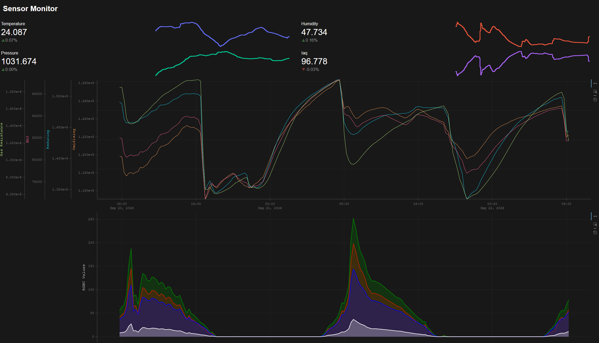

# Pi Sensor Monitor/Logger

## Install

Install these with apt:

```bash
sudo apt install python3-dev python3-rpi.gpio python3-spidev python3-pip python3-pil python3-numpy gcc fonts-freefont-ttf
```

Install these with pip:

```bash
sudo rm /usr/lib/python3.11/EXTERNALLY-MANAGED
sudo pip install st7789 bme680 bh1745 pimoroni-mics6814 sqlalchemy psutil click
```

Start on boot, add this to crontab:

```bash
@reboot /usr/bin/bash -c "cd /root/pi/sensor_monitor; python3 sensor_logger.py"
```

## Panel Dashboard

To run the Panel dashboard server, install Panel then run the server from this directory:

```bash
pip install panel bokeh
panel serve --autoreload --address 0.0.0.0 --port 8000 --allow-websocket-origin=*:8000 panel_dashboard.py
```



To start on boot:

```bash
@reboot /usr/bin/bash -c "cd /root/pi/sensor_monitor;panel serve --address 0.0.0.0 --port 8000 --allow-websocket-origin=*:8000 panel_dashboard.py"
```

## Streamlit Dashboard

To run the Streamlit dashboard server, install Streamlit then run the server from this directory:

```bash
sudo pip install streamlit
streamlit run streamlit_dashboard.py
```

This will listen on port 8501 by default. To start on boot, add this to crontab:

```bash
@reboot /usr/bin/bash -c "cd /root/pi/sensor_monitor; streamlit run streamlit_dashboard.py"
```

## Notes

Supposedly this is how to convert RGBC color from the bh1745 to RGB:

```python
def rgbc_to_rgb(r, g, b, c):
    if c > 0:
        r, g, b = [min(255, int((x / float(c)) * 255)) for x in (r, g, b)]
        return (r, g, b)

    return (0, 0, 0)
```
